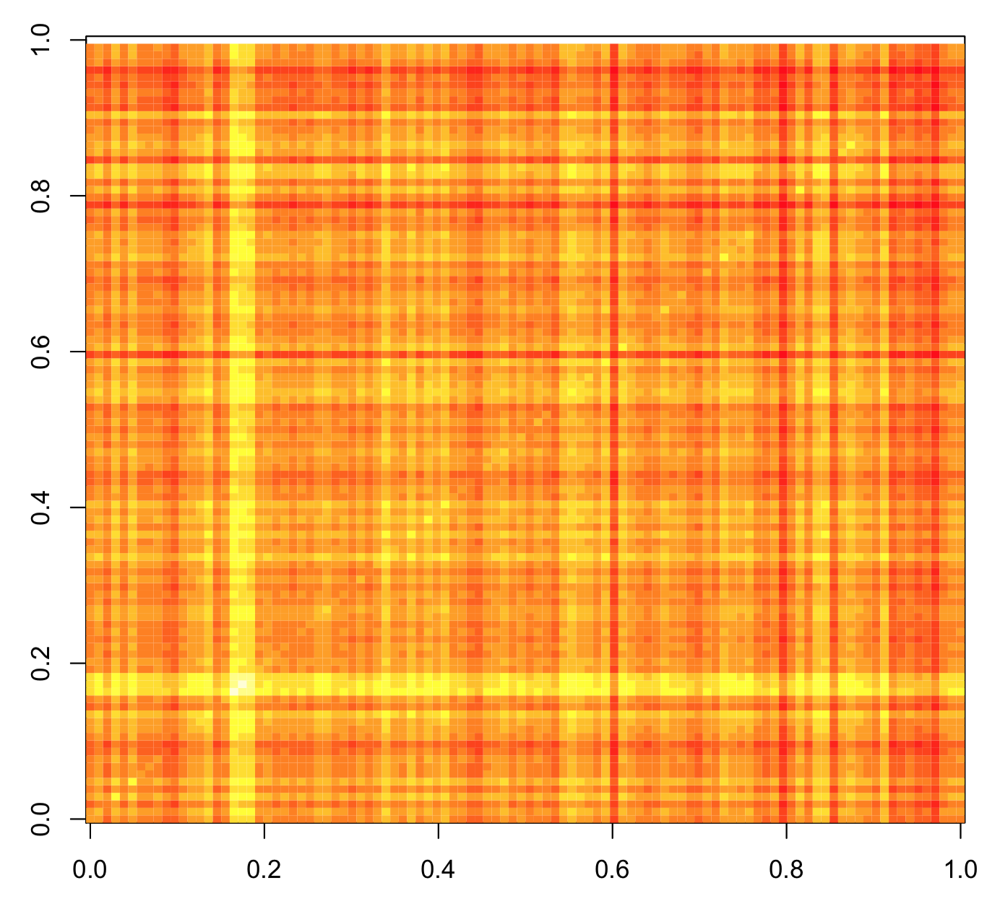
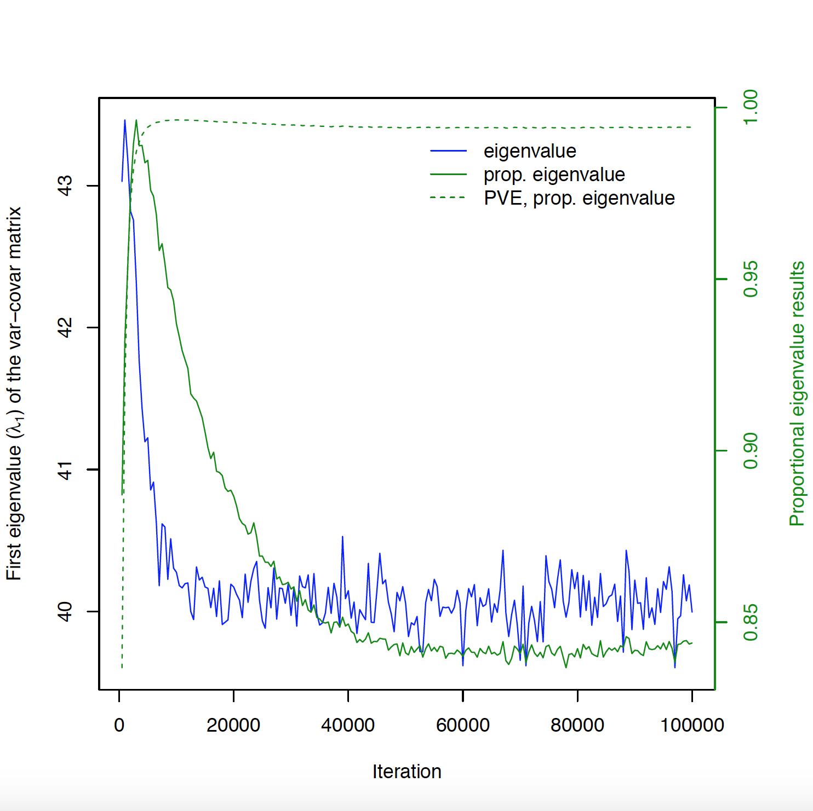
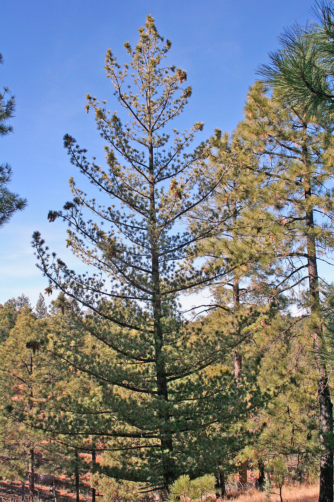

  

      <ul class="nav">
          <li><a href="{{ BASE_PATH }}/assets/Bagley_CV_May152018.pdf">cv</a></li>
          <li><a href="https://github.com/justincbagley">github</a></li>
          <li><a href="https://justinbagley.org/blog">blog</a></li>
          <li><a href="https://twitter.com/justincbagley">@justincbagley</a></li>
      </ul>
  

<table class="wide">
<tr>
  <td class="left">
    
  </td>
  <td class="right">
    
  </td>
</tr>
<tr>
  <td class="left">
    
  </td>
  <td class="right">
    
  </td>
</tr>
</table>

  

      <ul class="nav">
          <li><a href="index.html">back</a></li>
      </ul>
  

