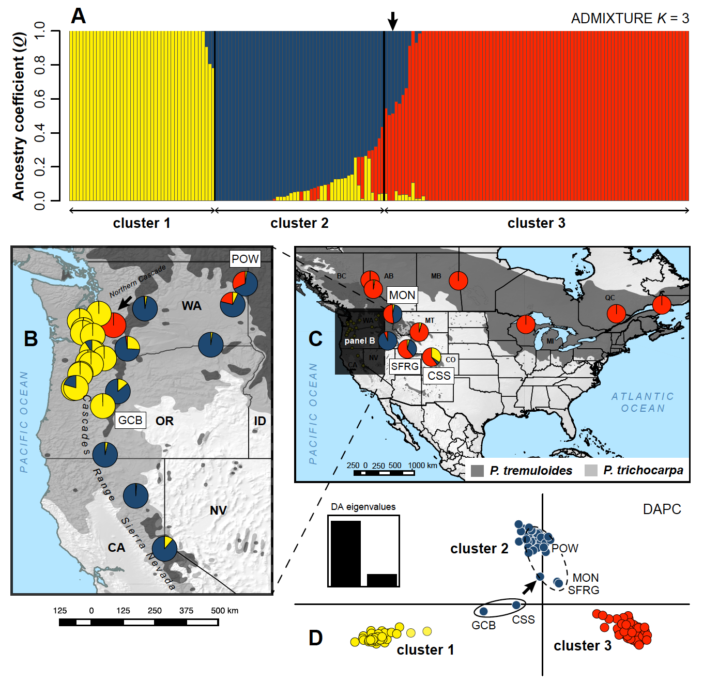
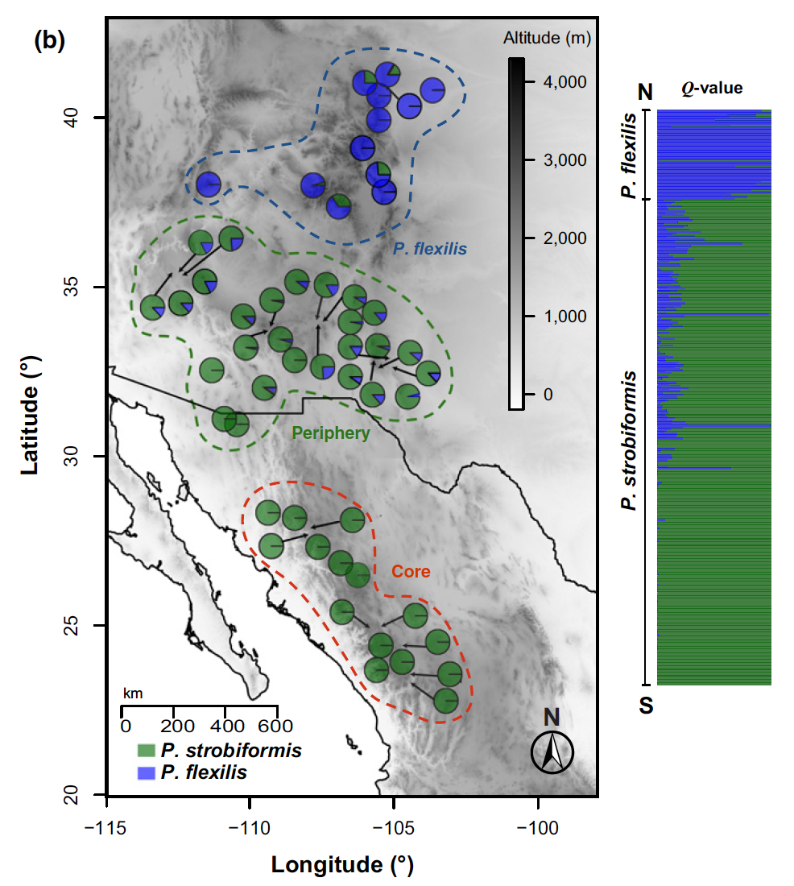
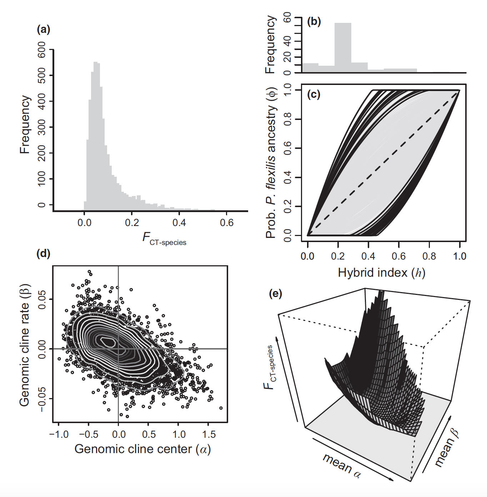

    

        <ul class="nav">
            <li><a href="#phylogeog">phylogeography</a></li>
            <li><a href="#specadapt">speciation & adaptation</a></li>
            <li><a href="#systemat">systematics</a></li>
            <li><a href="#software">bioinformatics</a></li>
            <li><a href="#thesis">dissertation</a></li>
<!--            <li><a href="#evolgen">evolutionary genetics</a></li>  -->
<!--            <li><a href="#syst">systematics</a></li>  -->
<!--            <li><a href="#evoleco">evolutionary ecology</a></li>  -->
<!--            <li><a href="#congen">conservation genomics</a></li>  -->
        </ul>
    

I am interested in how historical and ecological processes act to shape the spatial and 
temporal distributions of biodiversity in freshwater and terrestrial environments. Much of 
my work has focused on **1)** using **molecular [phylogeography](http://www.oxfordbibliographies.com/view/document/obo-9780199941728/obo-9780199941728-0041.xml) and species delimitation** to better 
understand population structure and history, species limits, and the role of historical 
biogeographical processes in shaping species distributions and community assembly in 
Neotropical biodiversity ‘[hotspots](https://en.wikipedia.org/wiki/Biodiversity_hotspot)’. However, high-throughput sequencing methods and 
bioinformatics have advanced rapidly, providing tools that I have actively used during 
the last few years to improve my phylogeographic and phylogenetic inferences and expand my 
research into **2)** disentangling the interplay between genetic drift, natural selection, and 
gene flow (hybridization) during **[speciation](https://www.nature.com/scitable/knowledge/library/speciation-the-origin-of-new-species-26230527) and local [adaptation](https://en.wikipedia.org/wiki/Adaptation)**. This latter focus includes 
studying the ecological and genetic bases of adaptation to challenging environments and 
ecological gradients, and will contribute to future genome-wide association study (GWAS) 
approaches combining genomic and phenotypic datasets to understand the genetic architecture 
of ecologically important traits.

Current projects focus on evolutionary and ecological genomics of North American and 
Neotropical _freshwater fishes_ (tetras, catfishes, cichlids, and livebearers) and _forest 
trees_ (white pines, quaking aspen, and Chilean pine). Within the Neotropics, I am mainly 
interested in uncovering drivers of biodiversity in the Mesoamerica (Central America) 
and Brazilian Cerrado biodiversity 'hotspots' (e.g. defined [here](https://www.nature.com/articles/35002501)).

**_Click on the lower navigation bar above to quickly access different topics below._**

---

### phylogeography of freshwater & terrestrial ecosystems

<table class="wide">
<tr>
  <td class="left">
    
  </td>
</tr>
</table>

**Phylogeography**, the study of the geographical distributions of genetic lineages within and 
among closely related species, has assumed a central role in molecular ecology for inferring 
the historical and ecological processes influencing present-day biodiversity patterns. Along 
with collaborators from the U.S., Brazil, and Mexico, I have been involved in a number 
of projects using single-species and comparative (multispecies) phylogeography approaches 
to improve our understanding of the diversification, stability, and assembly of North American 
and Neotropical biotic communities. This work currently focuses on three intriguing systems 
that present different contexts for understanding evolutionary processes: 1) North American 
forest trees, and freshwater fish assemblages of the 2) Mesoamerica (Central America) and 
3) Brazilian Cerrado biodiversity 'hotspots'. 

Here is a more in-depth look at my prior research in [phylogeography](../pages/phylogeog.html).

<a href="#top">top</a>

---

### genomics of speciation & local adaptation, with implications for climate change

<table class="wide">
<tr>
  <td class="left">
    
  </td>
  <td class="right">
    
  </td>
</tr>
</table>
<!-- swwp_fig5_dem.png -->

Understanding how barriers to gene flow arise, and new species boundaries are formed and 
maintained, is a central goal of evolutionary biology. Yet, the study of 'speciation', presents 
numerous challenges and requires integrative perspectives taking into account geographical 
factors (biogeography) and range dynamics, niche evolution, reproductive isolation, as well as 
the evolution of neutral and adaptive genetic variation in the context of demographic history. 
I have become interested in the ways in which plant versus animal systems can reveal different 
aspects of the speciation process. Our current projects on southwestern white pine (_Pinus
strobiformis_) highlight the role of hybridization and extrinsic factors during ecological 
speciation, and we are also using genome scan and environmental association analyses to understand 
local adaptation to climatic gradients and challenging environments (high elevation) in this 
system, with important implications for understanding tree responses to climate change. 
By contrast, some Neotropical fish lineages that I have studied (e.g. livebearers) are more 
predisposed to speciation through intrinsic pre- or postmating isolation, and exhibit presumed 
niche conservatism but a high degree of phenotypic variation. I am eager to develop future 
projects expanding on these two avenues of research.

<a href="#top">top</a>

---

### systematics, phylogenomics, & species delimitation

<!-- My phylogenetic systematics and taxonomy studies discover and determine evolutionary relationships among species, and then seek to describe new biodiversity. -->
[coming soon.]

<a href="#top">top</a>

---

### code & bioinformatics pipelines

<!-- The rapid growth of high-throughput sequencing technologies and their use in molecular ecology 
has precipitated a need for practical code and software solutions to the challenges presented by 
the resulting deluge of genome-wide DNA sequence data. -->
[coming soon.]

<a href="#top">top</a>

---

<iframe src="//www.slideshare.net/slideshow/embed_code/key/ComxCAB9CevHkU" width="595" height="485" frameborder="0" marginwidth="0" marginheight="0" scrolling="no" style="border:1px solid #CCC; border-width:1px; margin-bottom:5px; max-width: 100%;" allowfullscreen> </iframe> 
 <strong> <a href="//www.slideshare.net/justinbagley/current-projects-summary" title="Current Projects Summary" target="_blank">Current Projects Summary</a> </strong> from <strong><a href="https://www.slideshare.net/justinbagley" target="_blank">Justin C. Bagley</a></strong> 

<a href="#top">top</a>

---

### PhD dissertation research

[coming soon.]

<a href="#top">top</a>

---
